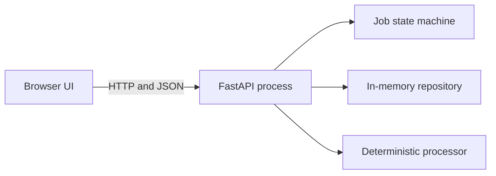

# DurableFlow

DurableFlow is a multi-tenant document-processing platform built as a
**problem-before-tool engineering curriculum**. A user will eventually upload a document,
submit a versioned processing job, observe durable progress, recover safely from failures,
and download a verified artifact.

The goal is not to collect technologies. The goal is to understand why each component
exists, which promise it protects, how it fails, and when it should be refused.

## Current stage: one deliberately fragile process

The first version contains:

- one FastAPI process;
- an in-memory job repository;
- a deterministic text processor;
- a plain browser interface that uses HTTP and JSON;
- legal job-state transitions;
- structured request logs and request IDs;
- unit and API tests; and
- an explicit experiment proving that restart loses all job state.

This is intentionally **not durable**. PostgreSQL will be introduced only after the state-loss
failure has been understood.

## Run it

Prerequisites: Python 3.12+ and [uv](https://docs.astral.sh/uv/).

```bash
make install
make check
make run
```

Open <http://127.0.0.1:8000>, select a small text file, and submit it. The browser reads the
file locally and sends JSON to the API. The API processes it synchronously and returns a job.

To deliberately make processing slow:

```bash
DURABLEFLOW_PROCESSING_DELAY_MS=60000 make run
```

Then cancel the browser request or restart the API and record what happened before proposing
a queue.

## API

```text
POST /v1/jobs          Create and synchronously process a text job
GET  /v1/jobs/{id}     Retrieve one job from this process's memory
GET  /healthz          Report process health and the current storage type
GET  /docs             OpenAPI documentation
```

Example:

```bash
curl -sS http://127.0.0.1:8000/v1/jobs \
  -H 'Content-Type: application/json' \
  -d '{"filename":"example.txt","content":"hello durable world"}'
```

## Architecture



Everything is one failure boundary. Restart the process and `Memory` disappears.

## Engineering rules

1. State the problem before choosing a tool.
2. Write the invariant before implementing the mechanism.
3. Predict failure before running the experiment.
4. Prefer the smallest architecture that satisfies the current promise.
5. Treat AI output as an untrusted draft until it is understood and verified.
6. Do not advance a stage until its mastery gate can be explained without reading the code.
7. Every portfolio claim must link to code, tests, telemetry, or a reproducible experiment.

See [the learning contract](docs/learning/learning-contract.md),
[roadmap](ROADMAP.md), and [first architecture decision](docs/decisions/0001-start-with-one-process.md).

## Intentionally absent

PostgreSQL, Redis, queues, workers, Docker, object storage, authentication, React, AWS,
Kubernetes, Kafka, and AI/model APIs are not missing features. They are deliberately delayed
until a concrete failure or product requirement earns them.

## Status vocabulary

- **Implemented:** code exists and automated checks pass.
- **Demonstrated:** a reproducible experiment proves the claimed behaviour.
- **Understood:** the learner can explain the design, alternatives, and failure semantics.
- **Operational:** deployment, telemetry, recovery, and runbook have been exercised.

No stage is described as mastered merely because an AI agent implemented it.

