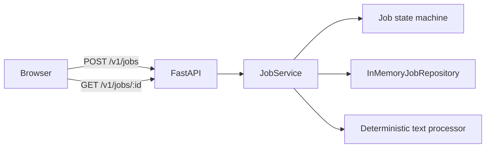

# Stage 1 architecture — one process

## Responsibility boundaries

| Component | Responsible for | Not responsible for yet |
|---|---|---|
| Browser | Reading a small text file, sending JSON, rendering the result | Authorization, durable progress, retries |
| FastAPI | HTTP validation, status codes, request IDs, response models | Long-running work or persistence |
| JobService | The application use case and transition sequence | HTTP or database details |
| Domain | Legal states, transitions, and result rules | Storage or networking |
| In-memory repository | Process-local job lookup | Durability, concurrency, replication |
| Processor | Deterministic checksum and text statistics | OCR, AI, external APIs |

## Request flow

1. The browser reads a local text file.
2. It sends the filename and text as JSON.
3. FastAPI validates the payload.
4. `JobService` creates a queued job and stores it.
5. The job moves to running.
6. The deterministic processor calculates SHA-256, byte, word, and line counts.
7. The job moves to succeeded and is saved.
8. FastAPI returns `201 Created` with the complete job representation.

## Failure boundary

The API, application service, repository, and processor share one operating-system process.
Killing that process destroys every job. This is intentional evidence for Stage 3.

## Bottlenecks and limitations

- Processing holds the request open.
- Memory is finite and process-local.
- Multiple API processes would have different job sets.
- Repeated submissions are not idempotent.
- There is no identity or authorization boundary.
- Text content is transported in JSON and has a small validation limit.

