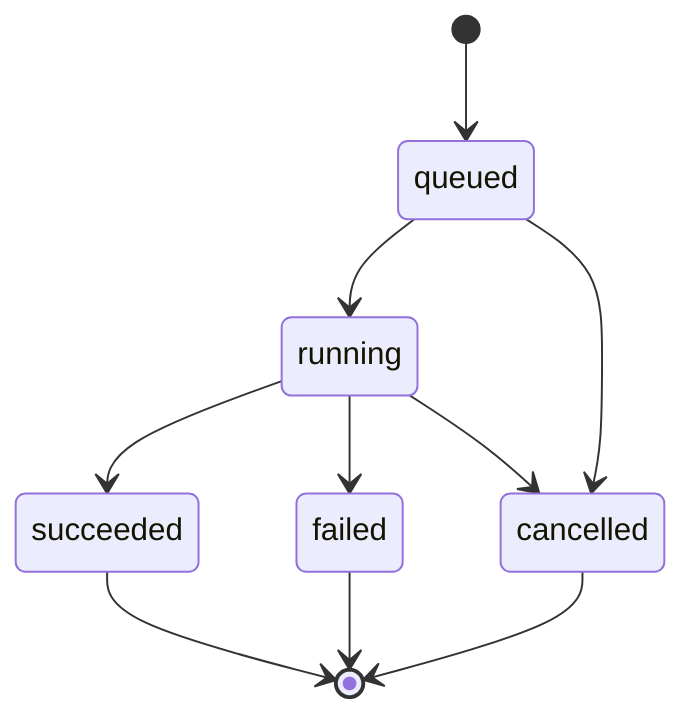

# Job state machine

## Target states

## Transition table

| Current | Allowed next state | Meaning |
|---|---|---|
| `queued` | `running` | An execution owner has started the job. |
| `queued` | `cancelled` | The job was cancelled before execution. |
| `running` | `succeeded` | Processing completed and a result exists. |
| `running` | `failed` | Processing stopped with an explicit failure. |
| `running` | `cancelled` | Cancellation was acknowledged according to policy. |
| Terminal | None | Terminal state cannot be reversed. A retry will create a new attempt later. |

Stage 1 follows `queued → running → succeeded` inside one synchronous request. It defines the
other transitions so future mechanisms cannot invent incompatible meanings.

